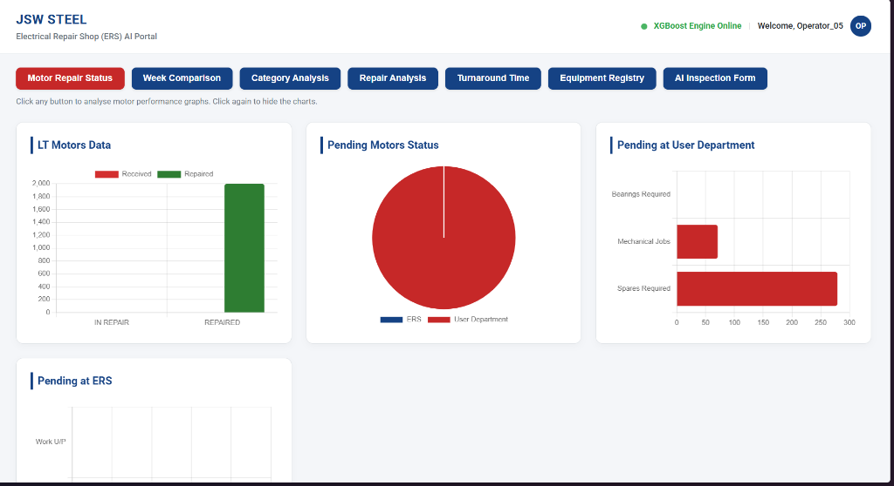
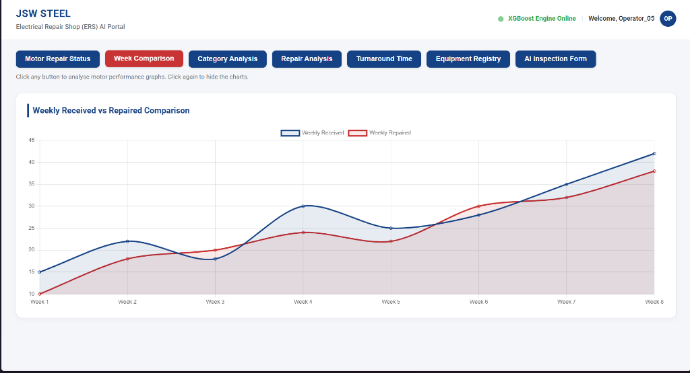
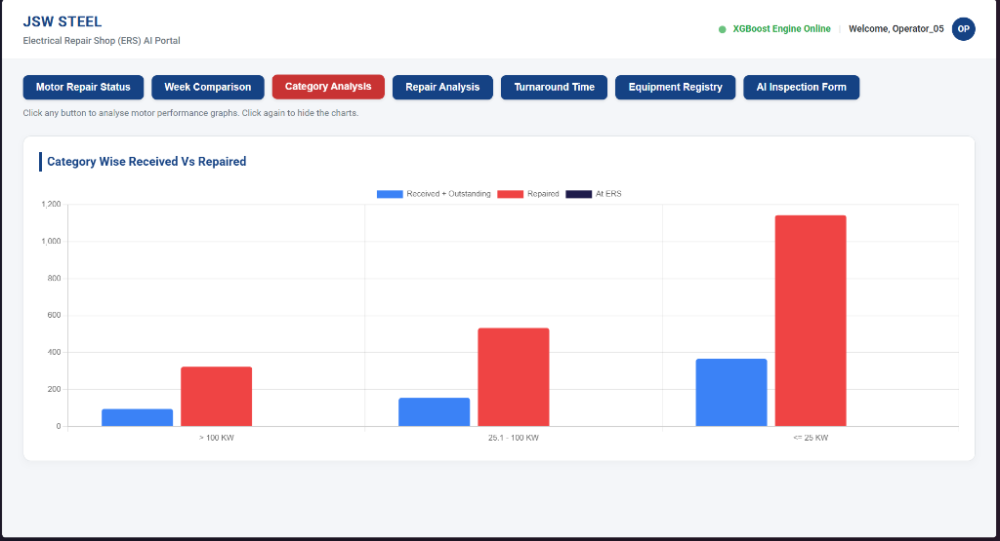
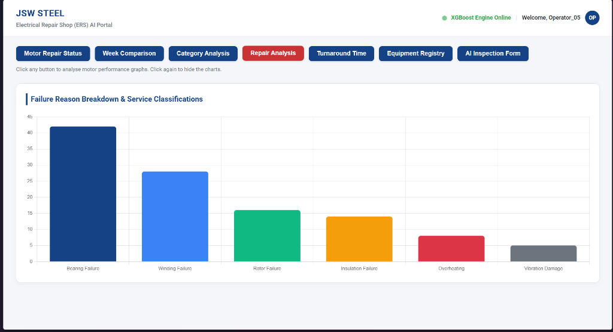
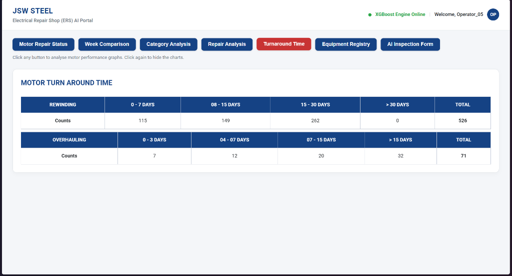
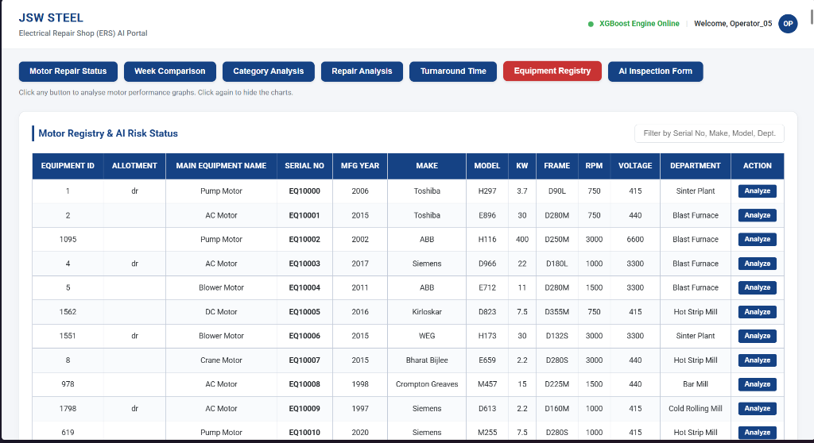
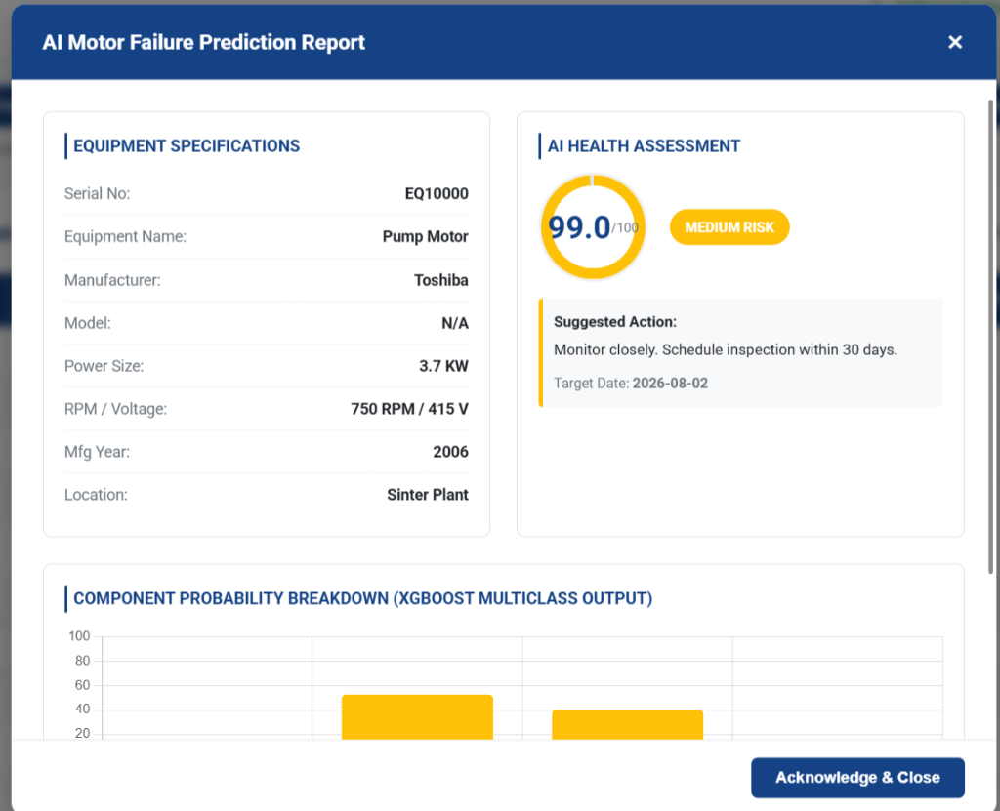
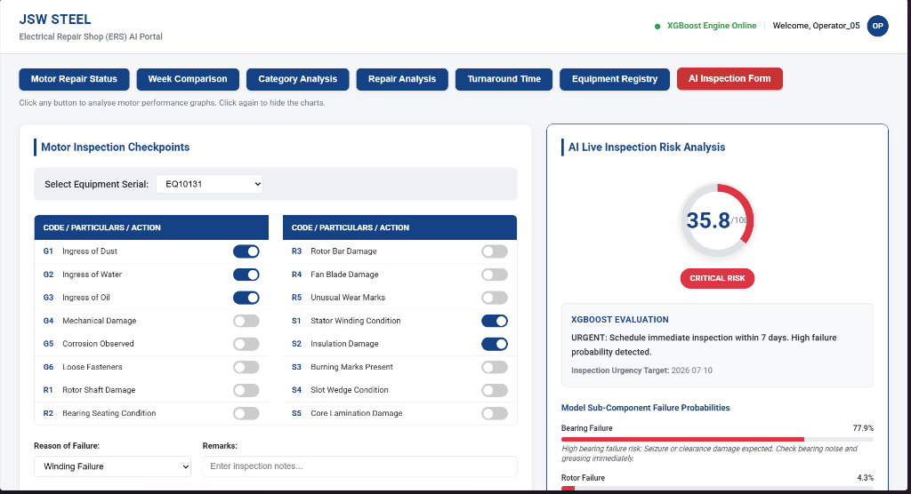

# JSW Steel ERS - AI Predictive Maintenance Portal
===================================================
An enterprise-ready AI predictive maintenance system integrated with JSW Steel's Electrical Repair Shop (ERS) application. The portal transitions maintenance workflows from reactive to condition-based diagnostics by predicting motor failure risk categories, highlighting sub-component vulnerabilities, and scheduling proactive inspections.

---

## 📖 Table of Contents
1. [Project Overview](#-project-overview)
2. [Portal Screenshots](#-portal-screenshots)
3. [Technical Architecture](#-technical-architecture)
4. [Feature Engineering Pipeline](#-feature-engineering-pipeline)
5. [Machine Learning Model](#-machine-learning-model)
6. [JVM-Native Deployment (ONNX)](#-jvm-native-deployment-onnx)
7. [Knowledge Transfer (KT) & Integration Guide](#-knowledge-transfer-kt--integration-guide)
8. [Installation & Local Execution](#-installation--local-execution)

---

## 🔍 Project Overview
The Electrical Repair Shop (ERS) processes motor repairs across various departments (e.g., Hot Strip Mill, Cold Rolling Mill). This project upgrades the ERS system by adding machine learning capability:
*   **Active Risk Assessment:** Predicts motor health score (0-100) and risk category (`LOW`, `MEDIUM`, `HIGH`, `CRITICAL`).
*   **Component-Level Diagnostics:** Evaluates probability scores for individual failure vectors (Bearing, Winding, Rotor, Insulation).
*   **Dynamic AI Inspection:** Connects operator checklist items in real-time to the XGBoost inference model to forecast failure risks before disassembly.

---

## 🖼 Portal Screenshots
Here are the mockups of the redesigned ERS portal tabs:

### 1. Motor Repair Status (Active Queue Charts)

*   **Description:** Displays real-time statistics of the Electrical Repair Shop (ERS) queue. Tracks current in-repair vs. completed counts, groups pending repairs by customer departments (e.g. Hot Strip Mill, Blast Furnace), and details workload distributions inside the ERS.

### 2. Week Comparison (Received vs Repaired Trends)

*   **Description:** A time-series trend visualization charting the weekly volume of incoming motors against successfully completed repairs over an 8-week cycle. Used to detect backlog spikes and monitor capacity limits.

### 3. Category Analysis (KW-divided Repair Counts)

*   **Description:** A comparative column chart breaking down repair requests by power classification (Large Motors > 100 KW, Medium Motors 25.1-100 KW, and Small Motors <= 25 KW). Helps ERS engineers analyze repair complexity trends.

### 4. Repair Analysis (Failure Reason Breakdown)

*   **Description:** A Pareto-style visualization tracking the primary failure modes diagnosed in ERS (Bearing failures, Winding faults, Rotor wear, Insulation degradation). Helps target systemic mechanical and electrical weaknesses in the fleet.

### 5. Turnaround Time (Rewinding & Overhauling Matrices)

*   **Description:** An SLA tracking grid showing the turnaround time (TAT) distribution grouped by repair type (Rewinding vs Overhauling). Counts are segmented into operational speed categories (0-7 days, 8-15 days, 15-30 days, etc.).

### 6. Equipment Registry & AI Risk Status

*   **Description:** The centralized motor inventory grid. It lists all active motors in the plant with their technical specs (KW, Frame, RPM, Voltage, Department) and features a direct "Analyze" action to trigger deep diagnostics.

### 7. AI Diagnostics Report Modal

*   **Description:** A detailed health assessment sheet triggered from the registry. It runs the motor's historical telemetry and repair count through the XGBoost model to produce a 0-100 Health Score, risk level, condition-based inspection target date, and a sub-component probability bar chart.

### 8. AI Inspection Checklist Form

*   **Description:** The operator's live checklist tool. Checking off standard visual observations (like G2 water ingress or S2 insulation damage) dynamically recalculates the health score and details bearing/winding/rotor failure probabilities, showing 1-2 line real-time maintenance advisories underneath.

---

## 🛠 Technical Architecture
The portal operates on a hybrid architecture designed to easily connect to JSW's environment:
*   **Model Training (Python):** Offline model training and validation utilizing XGBoost and Scikit-Learn.
*   **Interoperability Standard (ONNX):** The trained model is exported to Open Neural Network Exchange (ONNX) format, eliminating Python dependency in production.
*   **In-Memory Inference (Java/Tomcat):** JSW's Java web server runs predictions natively via the ONNX Runtime Java API.
*   **UI Representation (Angular/Vanilla JS):** A corporate light-themed dashboard matching the current JSW ERS screens.

---

## 📊 Feature Engineering Pipeline
Raw repair requisitions are transformed into **18 engineered features** before evaluation:

| Feature Group | Feature Name | Description |
| :--- | :--- | :--- |
| **Specifications** | `kw`, `rpm`, `voltage`, `current` | Physical electrical parameters of the motor |
| **History** | `repair_count`, `days_since_last_repair` | Frequency and recency of maintenance events |
| **Fault Vectors** | `bearing_failure_count`, `winding_failure_count`, `rotor_failure_count`, `insulation_failure_count` | Cumulative count of specific past sub-component failures |
| **Aggregates** | `dept_failure_rate`, `make_failure_rate` | Risk coefficients grouped by department and manufacturer |
| **Categories** | `make_encoded`, `equipment_type_encoded`, `duty_cycle_encoded`, `application_use_encoded` | Encoded categorical flags from historical metadata |

---

## 🤖 Machine Learning Model
The system uses an **XGBoost Multiclass Classifier** optimized using soft probabilities:
*   **Accuracy:** ~76.5% on ERS test parameters.
*   **ROC-AUC:** 0.93 (indicating highly stable class separation).
*   **Explainable AI (SHAP):** Feature impact is verified using SHapley Additive exPlanations to ensure predictions align with industrial thermodynamic and mechanical wear laws.

---

## ⚡ JVM-Native Deployment (ONNX)
Rather than hosting a Flask or FastAPI Python sidecar (which introduces network overhead and infrastructure costs), the model is compiled to ONNX. 
*   **Artifact:** `models/xgboost_risk_model.onnx`
*   **Inference Latency:** < 5ms execution time.
*   **Dependency:** Runs completely inside JSW's JVM, eliminating the need to install Python or library packages in production.

---

## 🎓 Knowledge Transfer (KT) & Integration Guide
This section contains full implementation instructions to deploy this portal live within JSW's actual ERS application.

### Phase 1: Local Installation (For Python/ML Developers)
If JSW developers want to run, test, or retrain the machine learning model locally on their computers:
1.  **Clone the Repository:** 
    ```bash
    git clone https://github.com/atish4y/jswinternship.git
    ```
2.  **Set up a Virtual Environment (venv):**
    To keep the Python libraries isolated and prevent conflicts, we set up a virtual environment (`venv`) before installing dependencies:
    *   **Create the environment:**
        ```bash
        python -m venv venv
        ```
    *   **Activate it (Windows PowerShell/CMD):**
        ```bash
        venv\Scripts\activate
        ```
    *   **Activate it (Linux/Mac):**
        ```bash
        source venv/bin/activate
        ```
3.  **Install Python Packages:** 
    ```bash
    pip install -r requirements.txt
    ```
    *(Installs pandas, numpy, scikit-learn, xgboost, and onnxmltools)*
4.  **Run the Pipeline:** 
    ```bash
    python src/run_pipeline.py
    ```
    *(Generates synthetic dataset, runs feature engineering, trains the XGBoost model, and exports the production `xgboost_risk_model.onnx` file)*

---

### Phase 2: Backend Integration (Java / Tomcat Core)
To merge this into the existing ERS Java backend:
1.  **Import the ONNX Dependency:**
    Add the official Microsoft ONNX Runtime dependency to the project's Maven configuration file (`pom.xml`):
    ```xml
    <dependency>
        <groupId>com.microsoft.onnxruntime</groupId>
        <artifactId>onnxruntime</artifactId>
        <version>1.16.3</version>
    </dependency>
    ```
2.  **Store the Model:** 
    Place the exported `xgboost_risk_model.onnx` file into JSW's Java project `src/main/resources` folder.
3.  **Deploy the Java Inference Service:**
    Write a simple service class (e.g. `PredictiveMaintenanceService.java`) that loads the model once on application startup:
    ```java
    package com.jsw.ers.service;

    import ai.onnxruntime.*;
    import java.util.*;
    import java.nio.FloatBuffer;

    public class PredictiveMaintenanceService {
        private OrtEnvironment env;
        private OrtSession session;

        public PredictiveMaintenanceService(String modelPath) throws OrtException {
            this.env = OrtEnvironment.getEnvironment();
            this.session = env.createSession(modelPath, new OrtSession.SessionOptions());
        }

        public float[] predictRisk(float[] featureArray) throws OrtException {
            // featureArray must contain the 18 engineered features in exact order
            String inputName = session.getInputNames().iterator().next();
            long[] shape = new long[]{1, 18};
            
            try (OnnxTensor tensor = OnnxTensor.createTensor(env, FloatBuffer.wrap(featureArray), shape)) {
                Map<String, OnnxTensor> inputs = Collections.singletonMap(inputName, tensor);
                try (OrtSession.Result results = session.run(inputs)) {
                    float[][] output = (float[][]) results.get(0).getValue();
                    return output[0]; // Returns [Prob_LOW, Prob_MEDIUM, Prob_HIGH, Prob_CRITICAL]
                }
            }
        }
    }
    ```
4.  **Database Mapping:** 
    Write a SQL query to fetch the motor's parameters (e.g. `KW`, `RPM`, `Age`, and counts of past failures from the database). Convert these into an 18-element float array.
    *   If on the active checklist form, temporarily increment the relevant failure count (e.g. if checklist items for `R2: Bearing Seating Condition` are checked, increment feature index `12` (`bearing_failure_count`) by `1.0f`).
    *   Call `predictRisk(features)` using the loaded ONNX session in Java to perform the prediction.

---

### Phase 3: Frontend Integration (Angular Core)
To merge this into the existing Angular frontend:
1.  **Registry Table:** 
    Add an "Analyze" button next to each motor row. When clicked, it calls a new REST API endpoint on the Tomcat server: `GET /api/predict/{serial_no}` and displays a popup modal showing the health score.
2.  **Inspection Checklist Form:** 
    In JSW's existing checklist component, capture the checkbox codes (`G1`-`G6`, `R1`-`R5`, `S1`-`S5`) when toggled, and send a JSON payload to a POST endpoint: `POST /api/predict/custom`.
3.  **UI Components:** 
    Drop the radial progress circle and progress bars (using vanilla HTML/CSS which is 100% compatible with Angular templates) directly onto the right-hand panel of the checklist page to show the live AI scores.


