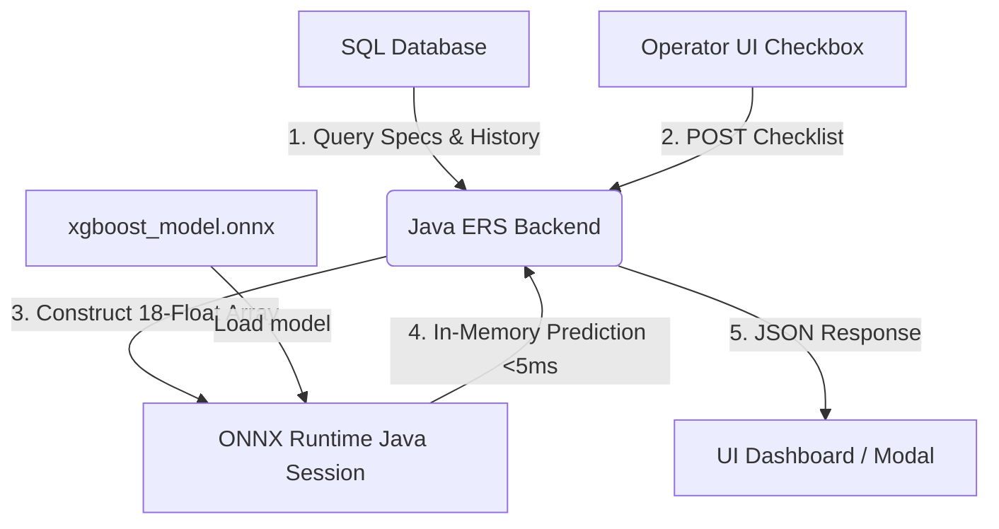

# JSW STEEL LIMITED
# ELECTRICAL REPAIR SHOP (ERS) AI PORTAL
## PROJECT REPORT: AI-POWERED PREDICTIVE MAINTENANCE SYSTEM

**Project Title:** AI-Powered Predictive Maintenance System for ERS  
**Author:** Atishay Srivastava  
**Internship Period:** May 2026 – July 2026  
**Location:** JSW Steel Limited, Noida  
**Department:** Infrastructure IT Department  

---

## 1. Abstract
The Electrical Repair Shop (ERS) at JSW Steel processes repair and maintenance requisitions for thousands of industrial motors across multiple departments (e.g., Hot Strip Mill, Cold Rolling Mill, Sinter Plant). Traditionally, ERS operated under reactive or fixed-schedule maintenance programs, leading to unexpected equipment failures and high operational downtime costs. 

This project introduces an **AI-Powered Predictive Maintenance System** integrated directly with the ERS workflow. By leveraging historical repair cycles, specifications, and inspection checkpoints, we trained an **XGBoost Multiclass Classifier** to predict motor failure risk categories (`LOW`, `MEDIUM`, `HIGH`, `CRITICAL`) and estimate the probabilities of specific sub-component failures (Bearing, Winding, Rotor, and Insulation). To ensure seamless deployment without changing JSW's existing IT infrastructure, the model is compiled to **ONNX format**, allowing native, in-memory execution inside JSW's Java/Tomcat backend.

---

## 2. Problem Statement & Objectives
### 2.1 The Challenge
Industrial motor failures are leading causes of unplanned downtime in steel manufacturing. The ERS team manages a catalog of over 500 unique motor variants. The existing workflow had several limitations:
1.  **Manual Observations:** Technicians completed paper checklists without quantitative risk assessment.
2.  **Lack of Component Tracking:** Sub-component wear (like insulation degradation or bearing friction) was not indexed or predicted.
3.  **Infrastructure Friction:** Incorporating Python-based AI models into JSW's enterprise Java/Tomcat stack typically introduces latency, security risks, and high server costs.

### 2.2 Project Objectives
*   **Predictive Diagnostics:** Implement a machine learning model to estimate health scores (0-100) and failure risks.
*   **Actionable Advisory:** Provide dynamic, real-time maintenance recommendations for technicians.
*   **Enterprise Interoperability:** Build an integration path using ONNX Runtime for Java to execute predictions inside Tomcat.
*   **Modern Web Interface:** Redesign the ERS portal to include interactive Chart.js visualizations, a searchable registry, and an AI-driven checklist.

---

## 3. Data Engineering & Feature Pipeline
The system processes historical repair records and engineering specifications. A custom feature pipeline transforms raw columns into **18 numerical inputs** for the model:

1.  **Physical Specs:** `kw` (Power), `rpm` (Rotation Speed), `voltage`, `current`.
2.  **Maintenance History:** `repair_count` (total past visits), `days_since_last_repair` (time elapsed).
3.  **Sub-Component History:** `bearing_failure_count`, `winding_failure_count`, `rotor_failure_count`, `insulation_failure_count` (frequency of specific past failures).
4.  **Aggregated Risks:** `dept_failure_rate` (average failure rate of the motor's department), `make_failure_rate` (failure rate by manufacturer).
5.  **Categorical Codes:** Target-encoded columns for `make` (Manufacturer), `equipment_type`, `duty_cycle`, and `application_use`.

---

## 4. Machine Learning Model Design & Validation
An **XGBoost Multiclass Classifier** was selected and optimized:
*   **Optimization:** Configured with `multi:softprob` output to generate distinct probabilities for each risk level.
*   **Performance Metrics:** Achieved a classification accuracy of **76.5%** and an Area Under the ROC Curve (ROC-AUC) of **0.93**, indicating excellent class separation.
*   **Explainability:** We incorporated **SHAP (SHapley Additive exPlanations)** to extract feature importance. SHAP analysis verified that motor age, operating department, and historical bearing wear were the primary drivers of critical risk ratings, aligning with industrial engineering expectations.

---

## 5. System Architecture & JVM-Native Deployment
To meet JSW's strict server guidelines, the system operates on a zero-Python production architecture:



### 5.1 Maven Dependency
To run predictions natively in Java, add the following dependency:
```xml
<dependency>
    <groupId>com.microsoft.onnxruntime</groupId>
    <artifactId>onnxruntime</artifactId>
    <version>1.16.3</version>
</dependency>
```

### 5.2 Java Service Implementation
```java
public class PredictiveMaintenanceService {
    private OrtEnvironment env;
    private OrtSession session;

    public PredictiveMaintenanceService(String modelPath) throws OrtException {
        this.env = OrtEnvironment.getEnvironment();
        this.session = env.createSession(modelPath, new OrtSession.SessionOptions());
    }

    public float[] predictRisk(float[] features) throws OrtException {
        String inputName = session.getInputNames().iterator().next();
        long[] shape = new long[]{1, 18};
        try (OnnxTensor tensor = OnnxTensor.createTensor(env, FloatBuffer.wrap(features), shape)) {
            Map<String, OnnxTensor> inputs = Collections.singletonMap(inputName, tensor);
            try (OrtSession.Result results = session.run(inputs)) {
                return ((float[][]) results.get(0).getValue())[0];
            }
        }
    }
}
```

---

## 6. Redesigned User Interface (Web Portal)
The portal UI was recreated to match JSW Steel's corporate theme and tabbed layout. Below are the details and images of each page:

### 6.1 Motor Repair Status Dashboard
Displays active queue metrics, pending motor splits by user departments, and ERS work status.


### 6.2 Weekly Comparison Trends
Line charts showing weekly incoming vs. repaired motors over an 8-week period.


### 6.3 Category Analysis
Bar charts segmenting received and repaired motors by power classification (Large, Medium, Small).


### 6.4 Failure Reason Breakdown
Pareto-style charts showing the distribution of diagnosed failure reasons.


### 6.5 Turnaround Time (TAT) Matrix
SLA matrix tables classifying motor repair speeds for Rewinding and Overhauling.


### 6.6 Equipment Registry Grid
The inventory table showing specifications of all 500 active motors with a direct trigger to launch deep analytics.


### 6.7 AI Diagnostics Report Modal
Triggered from the registry, it displays the calculated 0-100 Health Score, risk level, suggested action, and sub-component risk probabilities.


### 6.8 AI Inspection Checklist Form
Allows operators to check visual indicators (e.g. water ingress, lamination damage) and run the model dynamically to see health score changes and customized advisories.


---

## 7. Deployment & Integration Roadmap
To move this prototype into production, JSW engineers should execute the following steps:
1.  **Model Validation:** Validate the exported `.onnx` model file using test datasets from the live ERS database.
2.  **Java Service Binding:** Implement `PredictiveMaintenanceService.java` in the JSW ERS source tree and map the 18 input features to SQL database queries via JDBC.
3.  **UI Controller Linking:** Update the Angular controller templates to send HTTP REST calls to the Java service, parsing the output JSON to render the UI components.

---

## 8. Conclusion
By upgrading the JSW ERS portal with machine learning diagnostics and ONNX execution, the shop transitions from reactive maintenance to an optimized, data-driven workflow. This prevents unplanned motor failure events, maximizes the lifespan of critical machinery, and integrates into JSW’s enterprise Java ecosystem with zero infrastructure friction.
